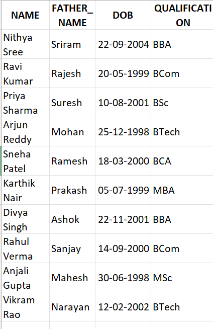
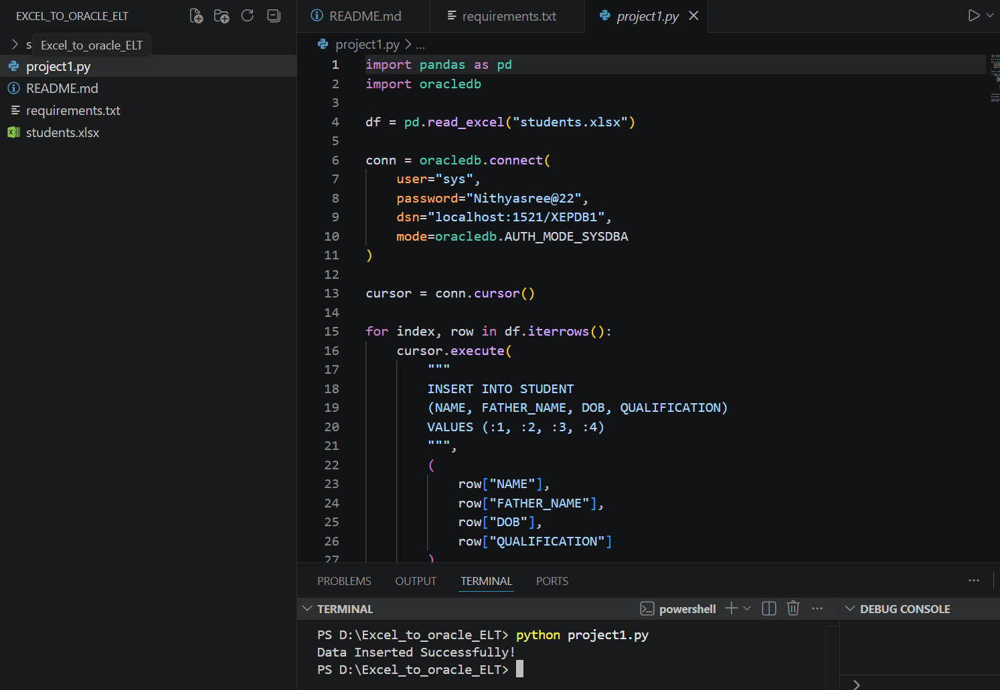
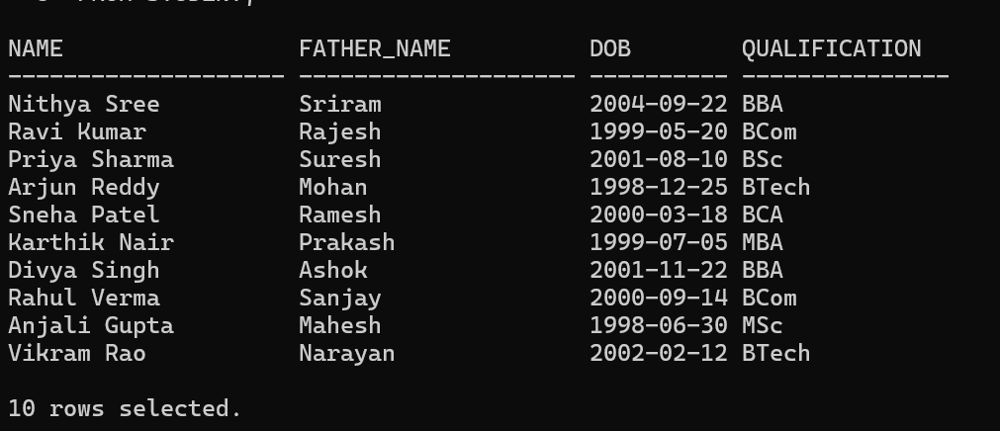

Excel to Oracle ETL Project

Overview

This project demonstrates an ETL (Extract, Transform, Load) process using Python, Pandas, and Oracle Database 21c XE.

The application reads student data from an Excel file and loads it into an Oracle Database table automatically.

Technologies Used

🐍 Python
🐼 Pandas
📊 OpenPyXL
🗄️ Oracle Database 21c XE
🔗 OracleDB Python Driver
💻 VS Code

Project Workflow

 Excel File →  Pandas DataFrame → Oracle Database

Input Columns

*  NAME
*  FATHER_NAME
*  DOB
*  QUALIFICATION

 Files Included

* `project1.py` – Main Python script
* `students.xlsx` – Sample input Excel file
* `requirements.txt` – Required Python libraries
* `README.md` – Project documentation

Features

* Reads Excel data using Pandas
* Connects to Oracle Database 21c XE
* Inserts records into Oracle STUDENT table
* Handles database transactions using commit()
* Demonstrates a simple ETL pipeline

Project Demo

#Input Excel File

Python Execution

Oracle Database Output

Author

*Nithya Sree*
